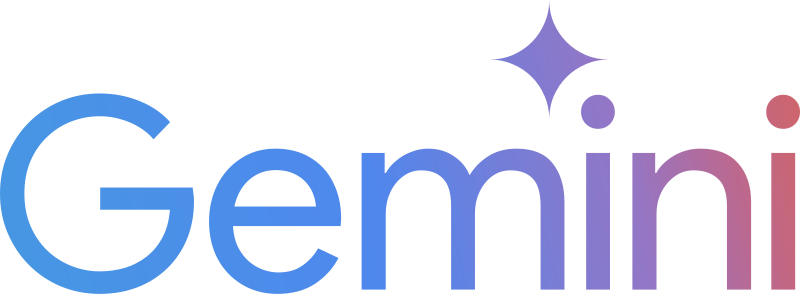

# Generative AI Intensive 

11 - 15 November, 2024

*Notes, resources and notebooks from the 5-Day Generative AI Intensive Course w/ Google*

<table style="border: none;">
  <tr>
    <td></td>
    <td></td>
  </tr>
</table>

 

## Resources 

🔗 [Google Event Page](https://rsvp.withgoogle.com/events/google-generative-ai-intensive)

🔗 [Kaggle Live Streams](https://www.youtube.com/watch?v=kpRyiJUUFxY&list=PLqFaTIg4myu-b1PlxitQdY0UYIbys-2es)

🔗 [Google AI Studio](https://aistudio.google.com)

 

## About

**Day 1: Foundational Models & Prompt Engineering** 

 - Explore the evolution of LLMs, from transformers to techniques like fine-tuning and inference acceleration. Get trained with the art of prompt engineering for optimal LLM interaction.

**Day 2: Embeddings and Vector Stores/Databases** 

 - Learn about the conceptual underpinning of embeddings and vector databases, including embedding methods, vector search algorithms, and real-world applications with LLMs, as well as their tradeoffs.

**Day 3: Generative AI Agents** 

 - Learn to build sophisticated AI agents by understanding their core components and the iterative development process.

**Day 4: Domain-Specific LLMs** 

 - Delve into the creation and application of specialized LLMs like SecLM and Med-PaLM, with insights from the researchers who built them.

**Day 5: MLOps for Generative AI** 

 - Discover how to adapt MLOps practices for Generative AI and leverage Vertex AI's tools for foundation models and generative AI applications.

